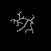

# TinyNeRF2D
This repository contains a Google Colab notebook containing the code used for the final project report Neural Radiance Fields For Lower Dimensions by Jesus Crespo for MIT class 6.819/6.869 Advances in Computer Vision.

The other files in this folder are GIF animations comparing the images the model synthesizes of the scene on top of the actual ground truth images of the same scene and complex.png, the hand-drawn scene used for testing in the report.

Naming convention is comparison_[scene]\_[positional encoding frequencies L]\_[training steps].gif.
